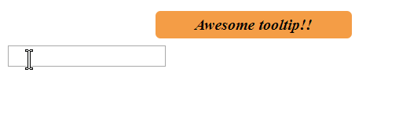

# React-Fancy-Components

React-Fancy-Components is a React Components library.

## Demo



## Installation

```bash
npm install react-fancy-components
```

## Usage

```javascript
import { tooltip } from 'react-fancy-components';

........

function App() {
  let TooltippedComponent = tooltip(<input />, {
    text: "Awesome tooltip!!",
    style: {
      fontWeight: "bold"
    }
  });
  return (
    <div className="App">
      <TooltippedComponent />
    </div>
  );
}
```

## Contributing

Pull requests are welcome. For major changes, please open an issue first to discuss what you would like to change.

## License

[MIT](https://choosealicense.com/licenses/mit/)
